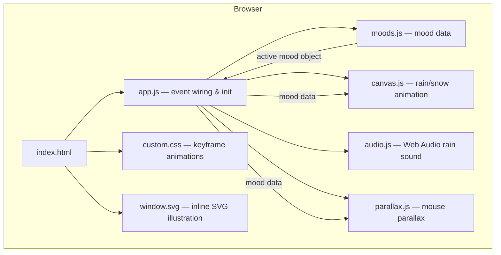

# Design Document: Cozy Rain Mood Generator

## Overview

Cozy Rain Mood Generator is a browser-only single-page application that renders an immersive, animated rainy-day scene. Clicking "Create My Mood" randomly selects one of eight themed moods, each of which drives every visual and audio parameter of the scene from a central data structure. There is no server, no build tool, and no framework — only an `index.html` file, optional co-located asset files, and public CDN resources.

The design follows a **data-driven scene architecture**: mood definitions live in a single JavaScript array (`moods.js`), and all rendering modules read from the active mood object. Adding a new mood requires only a new entry in that array.

---

## Architecture



**Data flow on mood activation:**
1. User clicks Mood_Button → `app.js` calls `selectMood(currentMoodId)`.
2. `selectMood` reads `moods.js` array, picks a random entry that is not the current one.
3. `app.js` calls `applyMood(mood)`, which fans out to:
   - `setBackground(mood.backgroundGradient)`
   - `canvas.startAnimation(mood)`
   - `setMist(mood)`
   - `setGlow(mood.glowColor)`
   - `setWindowTint(mood.windowTint)`
   - `setQuote(mood.quote)`
   - `setMoodLabel(mood.emoji, mood.name)`

---

## Components and Interfaces

### 1. `moods.js` — Mood Data Registry

Exports a `const MOODS` array. Each element is a plain object conforming to the `Mood` shape:

```js
/**
 * @typedef {Object} Mood
 * @property {string}  id                 — kebab-case unique identifier
 * @property {string}  name               — Display name
 * @property {string}  emoji              — Emoji icon
 * @property {string}  backgroundGradient — Full CSS gradient string
 * @property {string}  particleColor      — CSS color for canvas drops/flakes
 * @property {number}  particleCount      — Number of particles to spawn
 * @property {number}  particleSpeed      — Base fall speed in px/frame
 * @property {number}  mistOpacity        — 0–1 opacity for mist divs
 * @property {string}  glowColor          — CSS color for the Glow_Orb
 * @property {string}  windowTint         — CSS filter string (hue-rotate + brightness)
 * @property {string}  quote              — Mood quote text
 * @property {boolean} isSnow             — true only for Snowy Evening
 */
```

The eight moods and their key parameters:

| # | id | name | particleCount | particleSpeed | isSnow |
|---|---|---|---|---|---|
| 1 | `light-rain` | 🌧️ Light Rain | 80 | 3 | false |
| 2 | `thunderstorm` | ⛈️ Thunderstorm | 200 | 8 | false |
| 3 | `spring-rain` | 🌸 Spring Rain | 60 | 2.5 | false |
| 4 | `midnight-rain` | 🌌 Midnight Rain | 120 | 5 | false |
| 5 | `autumn-drizzle` | 🍂 Autumn Drizzle | 50 | 2 | false |
| 6 | `coffee-time` | ☕ Coffee Time | 40 | 1.5 | false |
| 7 | `snowy-evening` | ❄️ Snowy Evening | 90 | 1.5 | true |
| 8 | `rain-at-sunset` | 🌅 Rain at Sunset | 100 | 4 | false |

---

### 2. `app.js` — Event Wiring & Scene Orchestration

Public functions:

```js
initApp()             // Called on DOMContentLoaded; sets default mood, restores sound pref
selectMood(currentId) // Returns a random Mood object that is not currentId
applyMood(mood)       // Fans out to all scene-update helpers
setBackground(grad)   // Sets document.body's background style
setMist(mood)         // Removes old mist divs, creates new ones
setGlow(color)        // Transitions glow-orb color
setWindowTint(filter) // Transitions SVG filter
setQuote(text)        // Fade-out → set text → fade-in
setMoodLabel(e, name) // Updates emoji + name display
handleRipple(event)   // Creates and cleans up ripple span on button click
```

---

### 3. `canvas.js` — Particle Animation

```js
initCanvas(canvasEl)       // Stores canvas ref, adds resize listener
startAnimation(mood)       // Clears particles, spawns new batch, starts rAF loop
stopAnimation()            // Cancels rAF loop
updateParticles(mood)      // Moves all particles one frame; wraps y on overflow
drawParticles(ctx, mood)   // Renders all particles to canvas context
handleResize()             // Resizes canvas to window.innerWidth/innerHeight
```

Particle object shape:
```js
{ x, y, speed, length, opacity, dx /* snow drift */ }
```

---

### 4. `audio.js` — Web Audio Rain Sound

```js
initAudio()              // Creates AudioContext lazily on first user gesture
toggleSound(enable)      // Starts or stops the audio graph
buildAudioGraph(ctx)     // white noise BufferSource → LowPassFilter (400 Hz) → GainNode → destination
tearDownAudioGraph()     // Stops source, disconnects all nodes
saveSoundPref(state)     // Writes 'on'|'off' to localStorage key cozyRain_sound
restoreSoundPref()       // Reads localStorage, sets Sound_Toggle initial state
```

---

### 5. `parallax.js` — Mouse Parallax Handler

```js
initParallax(glowEl, windowEl) // Attaches mousemove listener to document
handleMouseMove(event)         // Calculates offset from viewport center, applies transform
```

Offset formula:
```
offsetX = (event.clientX / window.innerWidth  - 0.5) * 40   // −20px to +20px
offsetY = (event.clientY / window.innerHeight - 0.5) * 40
glowEl.style.transform    = `translate(${offsetX}px, ${offsetY}px)`
windowEl.style.transform  = `translate(${-offsetX * 0.5}px, ${-offsetY * 0.5}px)`
```

---

## Data Models

### Mood Object (full example — Light Rain)

```js
{
  id: "light-rain",
  name: "Light Rain",
  emoji: "🌧️",
  backgroundGradient: "linear-gradient(135deg, #1a1a2e 0%, #16213e 50%, #0f3460 100%)",
  particleColor: "rgba(174, 214, 241, 0.6)",
  particleCount: 80,
  particleSpeed: 3,
  mistOpacity: 0.08,
  glowColor: "#4a9eff",
  windowTint: "hue-rotate(200deg) brightness(0.95)",
  quote: "Let the rain wash away the noise of the world.",
  isSnow: false
}
```

### LocalStorage Schema

| Key | Values | Purpose |
|---|---|---|
| `cozyRain_sound` | `"on"` \| `"off"` | Persisted sound toggle state |

---

## Correctness Properties

*A property is a characteristic or behavior that should hold true across all valid executions of a system — essentially, a formal statement about what the system should do. Properties serve as the bridge between human-readable specifications and machine-verifiable correctness guarantees.*

### Property 1: Mood Selection Always Returns a Valid Mood

*For any* call to `selectMood(currentId)`, the returned mood's `id` must be a member of the `MOODS` array and must not equal `currentId`.

**Validates: Requirements 3.1, 3.2**

---

### Property 2: Mood Data Completeness

*For any* mood object in the `MOODS` array, every required field (`id`, `name`, `emoji`, `backgroundGradient`, `particleColor`, `particleCount`, `particleSpeed`, `mistOpacity`, `glowColor`, `windowTint`, `quote`) must be present, non-null, and non-empty.

**Validates: Requirements 15.1, 15.2, 15.3**

---

### Property 3: Scene Activation Reflects Mood Data

*For any* valid mood id, calling `applyMood(mood)` must result in the document's body background, glow color, window tint CSS filter, and quote text content each matching the corresponding field in the mood data object.

**Validates: Requirements 3.4, 4.1, 4.6, 15.3**

---

### Property 4: Canvas Covers Full Viewport

*For any* viewport width and height, after `handleResize()` executes, `canvas.width` must equal `window.innerWidth` and `canvas.height` must equal `window.innerHeight`.

**Validates: Requirements 5.1, 5.2**

---

### Property 5: Particle Vertical Wrap Invariant

*For any* rain particle object where `particle.y > canvas.height`, after `updateParticles()` executes for that particle, `particle.y` must be less than or equal to zero (reset to the top of the viewport).

**Validates: Requirements 5.4**

---

### Property 6: Sound Preference Round-Trip

*For any* sound state value (`"on"` or `"off"`), writing the value to `localStorage` under key `cozyRain_sound` and then calling `restoreSoundPref()` must result in the Sound_Toggle's visual state matching the persisted value.

**Validates: Requirements 13.4, 13.5**

---

## Error Handling

| Scenario | Handling Strategy |
|---|---|
| `AudioContext` creation blocked (browser policy or iOS restriction) | Catch the exception in `initAudio()`; log a console warning; keep Sound_Toggle visible but disable it gracefully |
| `localStorage` unavailable (private browsing, quota exceeded) | Wrap all `localStorage` calls in try/catch; fall back to in-memory default (`"off"`) |
| `canvas.getContext('2d')` returns null | Log error; hide canvas element; app continues without particle animation |
| `requestAnimationFrame` loop throws an unhandled error | Catch inside the rAF callback; stop the loop; log error |
| Mood data array is somehow empty | `selectMood` returns the hardcoded Light Rain fallback object |
| SVG fails to load (if externalized) | `` fallback with alt text "Cozy window illustration" |

---

## Testing Strategy

### Dual Approach

Both **unit/example tests** and **property-based tests** are used. Unit tests validate specific behavior and edge cases; property tests validate universal invariants across a wide input space.

### Property-Based Testing Library

Use **fast-check** (JavaScript PBT library) for all property tests. Each property test must run a minimum of **100 iterations**.

Tag format for each property test:
```
// Feature: cozy-rain-mood-generator, Property N: <property_text>
```

### Unit / Example Tests (Vitest or Jest)

| What to test | Type |
|---|---|
| `MOODS` array has exactly 8 entries | Example |
| Default mood on `initApp()` is `light-rain` | Example |
| Snow particles for Snowy Evening have `dx !== 0` | Example |
| Toggling sound writes `"on"` / `"off"` to localStorage | Example |
| Ripple element is added and removed from DOM after click | Example |
| Quote element text changes after `setQuote()` | Example |

### Property-Based Tests (fast-check)

| Property | Arbitrary inputs | Assertion |
|---|---|---|
| Property 1: selectMood returns valid, non-repeated mood | arbitrary mood id from MOODS | result.id ∈ MOODS ids AND result.id ≠ currentId |
| Property 2: Mood data completeness | every entry in MOODS array | all required keys present and non-empty |
| Property 3: Scene activation reflects mood data | arbitrary mood from MOODS | body style, glow, tint, quote match mood object fields |
| Property 4: Canvas covers full viewport | arbitrary integer width/height pairs | canvas dimensions match after handleResize |
| Property 5: Particle wrap invariant | particle with arbitrary y > canvasHeight | particle.y ≤ 0 after updateParticles |
| Property 6: Sound preference round-trip | arbitrary selection of 'on' or 'off' | restoreSoundPref() matches written value |

### Integration / Manual Checks

- Visual regression: Screenshot each of the 8 moods and compare to reference images.
- Accessibility: Run axe-core or Lighthouse accessibility audit; verify all interactive elements have `aria-label`.
- Performance: Lighthouse Performance ≥ 80 on desktop.
- Cross-browser: Manual smoke test in Chrome, Firefox, Edge, and Safari.
