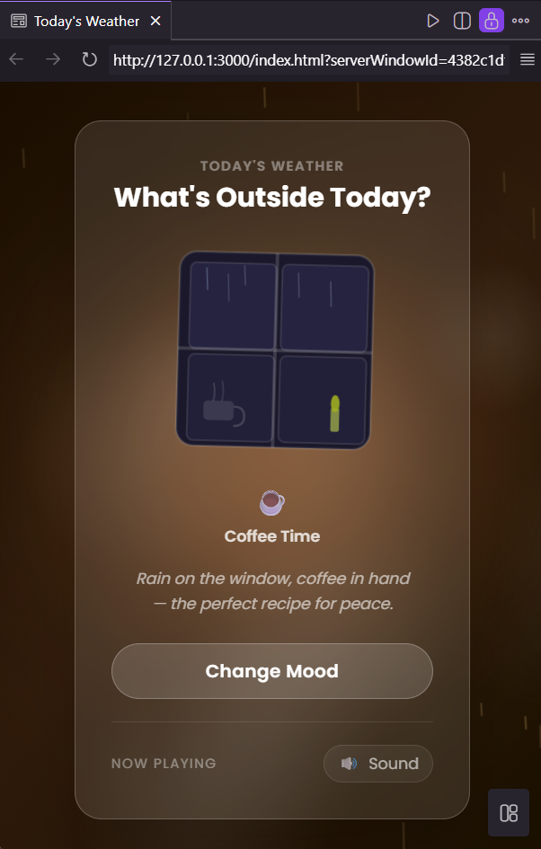

# Today's Weather

A simple web application that lets users explore different weather scenes with animations and ambient sound. This project was built as part of my frontend learning journey while exploring spec-driven development using Kiro AI Agent.

---

## Preview



---

## Features

- Explore different weather scenes
- Animated rain and snow effects
- Ambient background sound
- Smooth transitions between weather conditions
- Responsive layout
- Interactive weather button

---

## Built With

- HTML5
- Tailwind CSS
- Vanilla JavaScript
- Canvas API
- Web Audio API
- Kiro AI Agent

---

## Project Structure

```text
assets/
├── css/
├── js/
└── svg/

screenshots/
└── preview.png

index.html
package.json
README.md
```

---

## Things I Ran Into

### Restoring files after an accidental revert

Some generated files were removed after I accidentally reverted the project. I restored the project by checking the file structure and recreating the missing files based on the specification.

### Running the project locally

At first, Live Server couldn't run because Node.js wasn't installed. After installing Node.js, I was able to run the project locally.

### Git and GitHub workflow

While working on this project, I learned how to clone a repository, commit changes, resolve a push conflict using `git pull --rebase`, and publish the project to GitHub.

---

## What I Practiced

- Organizing a frontend project
- Working with Git and GitHub
- Using Tailwind CSS
- Creating simple animations with the Canvas API
- Using the Web Audio API
- Building a project from specifications with Kiro AI Agent

---

## Ideas for Improvement

- Add more weather scenes
- Add sound volume control
- Improve accessibility
- Optimize animation performance


---

## About This Project

This project was built with the help of Kiro AI Agent as part of my learning process. I reviewed, tested, and adjusted the generated code before publishing the project.
